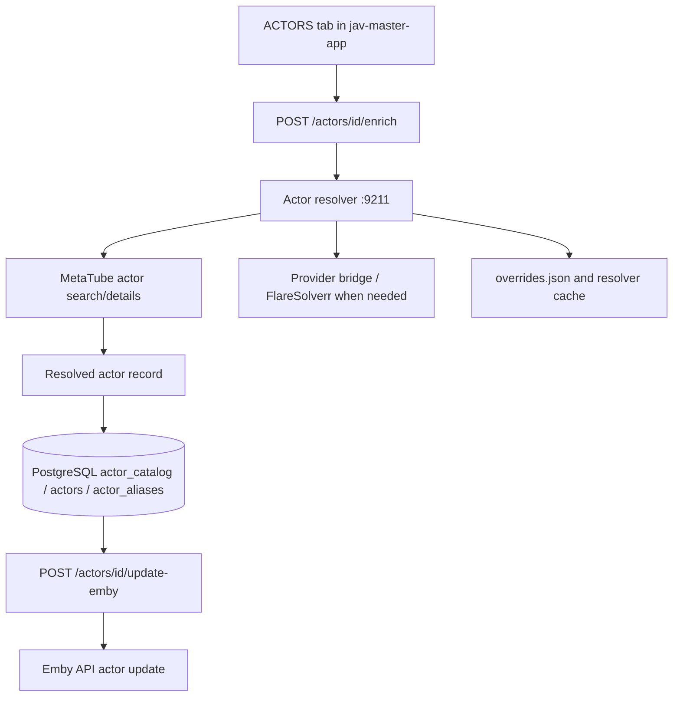
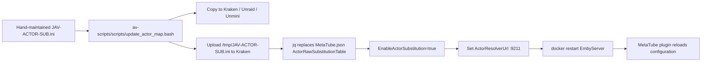
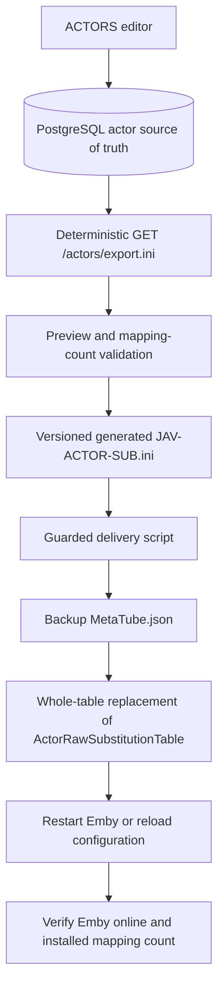

# Actor identity, database, INI, and Emby substitution flow

This document answers two separate questions:

1. What happens today when actor data is enriched and delivered to Emby.
2. What the intended database-driven replacement flow should be.

The current implementation is **not yet database-to-INI automatic**. The
database editor and deterministic export are still requirements work.

## Current flow: actor database enrichment



The current backend writer is `jav-master-app/backend/main.py`:

- `enrich_actor()` resolves an actor and writes metadata to `actors`.
- It appends discovered aliases to `actor_aliases`.
- It updates the actor catalog projection used by the ACTORS tab.
- `update_actor_emby()` sends the current actor record to Emby.

The existing requirements document identifies this as overwrite-style enrichment
with no field locks or complete provenance. See
[`metatube-work/docs/ACTOR-EDITOR-REQUIREMENTS.md`](../metatube-work/docs/ACTOR-EDITOR-REQUIREMENTS.md).

## Current flow: INI substitution delivery



Current source and distribution locations:

| Component | Current location/owner | Behavior |
| --- | --- | --- |
| Actor database | `jav-master-app` PostgreSQL tables `actor_catalog`, `actors`, `actor_aliases` | Enrichment writes here, but it does **not** generate the INI automatically. |
| INI source | `metatube-work/plugin/config/JAV-ACTOR-SUB.ini` | Version-controlled, hand-maintained mapping; currently the source of truth for substitutions. |
| Push script | `av-scripts/scripts/update_actor_map.bash` in the Homelab repository | Validates, copies, uses `jq` to replace the Emby plugin field, restarts Emby, and verifies mapping count. |
| Emby plugin config | `/mnt/cache_nvme_apps/appdata/EmbyServer/plugins/configurations/MetaTube.json` on Kraken | Stores `ActorRawSubstitutionTable` and `EnableActorSubstitution`. |
| Plugin parser | `metatube-work/plugin/Jellyfin.Plugin.MetaTube/Helpers/SubstitutionTable.cs` | Parses `source=target`; a blank target removes the source actor. |
| Movie metadata application | `.../Providers/MovieProvider.cs` | Applies exact actor substitutions before canonical actor resolution and Emby person creation. |

## What “replace rather than update” means today

The push script performs a **whole-table replacement**:

```text
MetaTube.json.ActorRawSubstitutionTable = contents of JAV-ACTOR-SUB.ini
```

It does not merge individual rows with the existing Emby table. The old table is
backed up first as `MetaTube.json.backup-<timestamp>`, then Emby is restarted.
The plugin itself replaces matching actor strings in each movie's actor list;
it does not update the actor database when the substitution is applied.

Therefore the current chain is:

```text
Actor DB enrichment ──(manual operator export/edit)──> INI
INI ──(whole-table jq replacement)──> MetaTube.json
MetaTube.json ──(plugin substitution)──> movie actor names in Emby
```

There is currently no automatic actor DB → INI → Emby trigger.

## Planned database-driven flow



The requirements document proposes two valid delivery routes:

- **Route A — generated file:** PostgreSQL generates the INI, then the existing
  `update_actor_map.bash` delivery path replaces the Emby table. This preserves
  today's behavior and requires an Emby restart.
- **Route B — resolver-backed:** the actor resolver reads `actor_catalog` and
  `actor_aliases` directly. The INI remains only for legacy suppressions and
  one-off overrides; normal edits take effect without an INI push or restart.

The requirements currently prefer making the database the editing source of
truth, preserving deterministic export, recording provenance/locks, and treating
blank-target suppression rows as first-class data.

## Exact answer: where to update this flow

The current flow is split across these files:

1. `jav-master-app/backend/main.py` — actor enrichment and database writes.
2. `metatube-work/stack/actor-resolver/resolver.py` — provider aggregation,
   overrides, caching, and canonical actor output.
3. `metatube-work/plugin/config/JAV-ACTOR-SUB.ini` — current substitution source.
4. `av-scripts/scripts/update_actor_map.bash` — replacement upload and Emby
   restart.
5. `metatube-work/plugin/Jellyfin.Plugin.MetaTube/Helpers/SubstitutionTable.cs`
   — parser and replacement semantics.
6. `metatube-work/plugin/Jellyfin.Plugin.MetaTube/Providers/MovieProvider.cs`
   — applies the table to movie actors.

The missing link is a committed, deterministic **actor database export** and a
guarded call from that export into the existing replacement script. That is why
the requirements document is marked “requirements / handoff — not started.”

## Safety requirements for implementation

- Generate the complete table deterministically; do not append blindly.
- Preserve suppressed aliases as blank-target entries so enrichment cannot
  resurrect them.
- Back up `MetaTube.json` before replacement.
- Validate syntax and mapping count before touching Emby.
- Restart Emby only after the new file passes validation.
- Verify Emby health and the installed mapping count after restart.
- Never commit Emby keys, MetaTube tokens, Windmill tokens, cookies, or database
  passwords.
