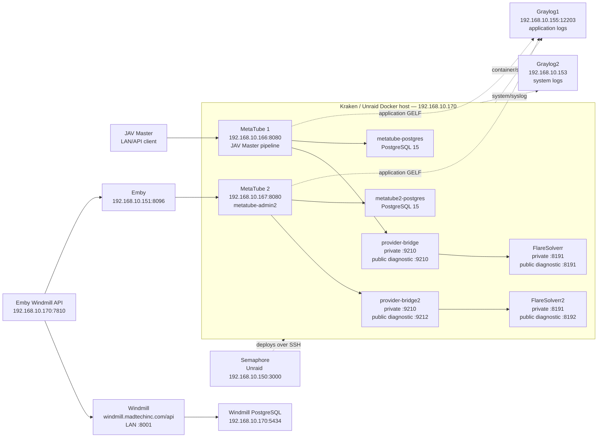

# MetaTube stack architecture and placement

This is the current deployment map for the MetaTube services, their Docker
dependencies, Windmill, and the logging hosts. It describes the deployed
Kraken/Unraid layout; it is not a second Compose file.

For the actor database, substitution-table, and Emby delivery path, see
[`ACTOR_IDENTITY_SUBSTITUTION_FLOW.md`](ACTOR_IDENTITY_SUBSTITUTION_FLOW.md).

## Deployment drawing

## Hosts and responsibilities

| Host | Role | Relevant locations/endpoints |
| --- | --- | --- |
| `192.168.10.170` (`Kraken`) | Docker host for the complete MetaTube and Windmill application stack | MetaTube Compose: `/mnt/cache_nvme_apps/appdata/metatube-stack`; Windmill data: `/mnt/cache_nvme_apps/appdata/windmill`; Emby Windmill app: `/mnt/cache_nvme_apps/appdata/emby-windmill-app`; Windmill UI/API is published as `:8001`; Emby Windmill API is `:7810` |
| `192.168.10.150` (`Unraid`) | Semaphore deployment controller | Semaphore UI `:3000`; runs the guarded MetaTube deployment tasks against Kraken |
| `192.168.10.151` | Emby server | `http://192.168.10.151:8096`; the Emby plugin calls MetaTube2 for metadata |
| `192.168.10.155` (`graylog1`) | Application-log Graylog LXC/service | `https://graylog1.madtechinc.com`; MetaTube GELF input `:12203`; search API `:9000` |
| `192.168.10.153` (`graylog2`) | System/syslog Graylog LXC/service | `https://graylog2.madtechinc.com`; do not use this endpoint for MetaTube application GELF |

## Docker services on Kraken

| Service/container | Function | Persistent data or isolation |
| --- | --- | --- |
| `metatube` | MetaTube1 API for JAV Master | LAN `192.168.10.166:8080`; config/trace volume `/mnt/cache_nvme_apps/appdata/metatube-server-charleshuang233:/config`; uses `metatube-postgres`, `provider-bridge`, and `metatube-flaresolverr` |
| `metatube-postgres` | MetaTube1 PostgreSQL 15 | `/mnt/user/appdata/metatube/postgres` |
| `metatube-provider-bridge` | Provider adapter, MDC-NG access, actor substitution state | diagnostic host port `9210`; state `./provider-bridge/state`; uses `flaresolverr:8191` |
| `metatube-flaresolverr` | Browser challenge solver for MetaTube1/JAV Master | diagnostic host port `8191`; never share its state with MetaTube2 |
| `metatube2` | Dedicated Emby-only MetaTube API | LAN `192.168.10.167:8080`; public admin `https://metatube-admin2.madtechinc.com/admin`; config/trace volume `/mnt/cache_nvme_apps/appdata/metatube2-server:/config`; uses the `*2` dependencies |
| `metatube2-postgres` | MetaTube2 PostgreSQL 15 | `/mnt/user/appdata/metatube2/postgres` |
| `metatube2-provider-bridge` | Isolated provider adapter for Emby | diagnostic host port `9212`; state `./provider-bridge2/state`; uses `flaresolverr2:8191` |
| `metatube2-flaresolverr` | Isolated browser solver for Emby | diagnostic host port `8192` (container port `8191`) |
| `windmill` | Windmill workflow server | LAN `192.168.10.170:8001`; public API base `http://windmill.madtechinc.com/api`; data/cache under `/mnt/cache/appdata/windmill` and `/mnt/cache_nvme_apps/appdata/windmill` |
| `emby-windmill-api` / `emby-windmill-app` | Thin Emby/Windmill orchestration API and UI | host port `192.168.10.170:7810`; uses `WINDMILL_URL=http://windmill.madtechinc.com/api` and the `admins` workspace |

### Windmill PostgreSQL note

The live Windmill container is configured with a PostgreSQL endpoint at
`192.168.10.170:5434` (credentials are intentionally not documented). This is
the Windmill database on the Kraken/Unraid side of the deployment. The two
MetaTube PostgreSQL containers are separate databases and must not be reused by
Windmill.

## Request and logging paths

1. JAV Master calls MetaTube1 at `192.168.10.166:8080`.
2. Emby calls MetaTube2 at `192.168.10.167:8080`.
3. Each MetaTube instance calls its own provider bridge; provider bridges call
   their own FlareSolverr instance. The two paths must remain isolated.
4. Windmill workflows use `http://windmill.madtechinc.com/api`; the
   `emby-windmill-api` service supplies the token and `admins` workspace.
5. Structured application traces and provider events are sent to Graylog1
   (`192.168.10.155:12203`). Container/system collection is separate from the
   application GELF stream, and Graylog2 is reserved for system/syslog.

## Change-control rules

- Update `deployment/compose.yaml` and this document together when a service,
  port, volume, or dependency changes.
- Never point MetaTube provider traffic at Windmill. Windmill is a workflow API;
  provider traffic uses `provider-bridge` or `provider-bridge2`.
- Keep MetaTube1 and MetaTube2 PostgreSQL, bridge state, FlareSolverr sessions,
  and trace volumes separate.
- Do not commit `.env` files, Windmill tokens, Emby keys, provider cookies, or
  database passwords.
- After deployment, verify both `/v1/providers` endpoints, both admin pages,
  bridge health, FlareSolverr health, Windmill `/api`, and the Graylog1 GELF
  input before declaring the stack healthy.

*Last verified against the checked-in Compose file and live Kraken container
inventory on 2026-09-23.*
